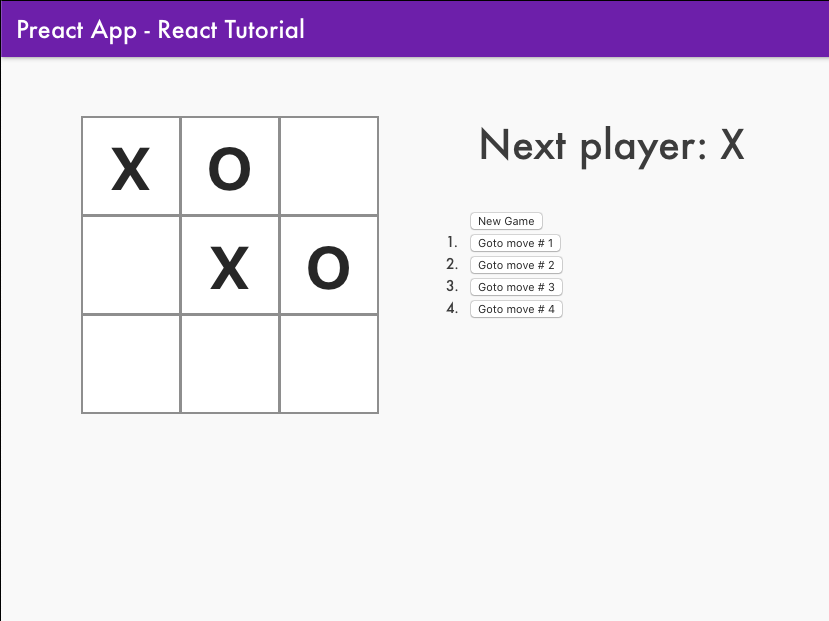

# Preact TypeScript Tic Tac Toe
Followed the tutorial from https://reactjs.org/tutorial/tutorial.html
to create a simple game using preact typescript. Added a few changes and improvements to suit my requirements.

## Preact CLI Commands
*   `npm install`: Installs dependencies

*   `npm run dev`: Run a development, HMR server

*   `npm run serve`: Run a production-like server

*   `npm run build`: Production-ready build

*   `npm run lint`: Pass TypeScript files using TSLint

*   `npm run test`: Run Jest and Enzyme with
    [`enzyme-adapter-preact-pure`](https://github.com/preactjs/enzyme-adapter-preact-pure) for
    your tests

For detailed explanation on how things work, checkout the [CLI Readme](https://github.com/developit/preact-cli/blob/master/README.md).
